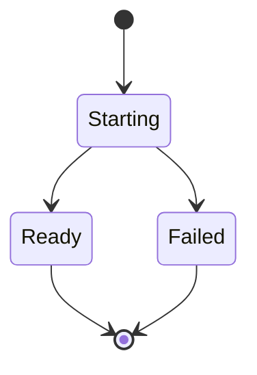

# Post-Deployment Validation Concepts

Core concept definitions and caveats to be aware of when defining a strategy for verifying system behavior post-deployment.

I hope this text will be used for defining a good strategy, bringing everyone on a team - from junior to senior together into a discussion of setting a common baseline and understanding of distinctions and subtleties. The content is a likely candidate for a skills.md file perhaps.

I am purposefully leaving out any tool recommendations in order to keep the text high-level and to keep it clear of bias towards a particular stack.

## Slice and Dice

### Component Recursion
These definitions work for systems, and can be broken down to aggregate components and again into covering subcomponents.

A system can be made up of architectural quanta - i.e. groups of separately deployable units or such as a set of microservices. Such quanta make up a set of subsystems.

It does not make sense to talk about readiness or health without specifying what falls under our implied "what". A component can be healthy while the overall system is not. The overall system can also be healthy whilst there are unhealthy or failing components (within some pre-defined threshold).

Additionally, components are often structured in layers, adding another dimension to their design which we will explore next.

## Systems are like Onions
Today, most services run in some form of virtualised environment. As a result there are at least two operating systems under the service you want to monitor (host OS + guest OS). Each layer makes up the platform of the next one - at some point, containerization (like docker) or virtualization (like a Virtual Machine) will make the platform isolated for the component - but other subcomponents will share an identical layer. Similarly, these layers will share strengths and weaknesses, and might be monitored in the same manner.

## Readiness Checks
Performed once at initiation and answers the question: 
Is the service ready to serve requests in a meaningful way yet?

The check is very useful for blocking downstream processes that require the component to be functional before proceeding.

Focus is on whether the component is able to serve main functionality, such as answering http requests, the component might present itself as ready but with degraded performance (a system might be ready to perform work but slower whilst warming up a cache writing things to disk).

The check ought to be time-bound, and must eventually result in failure to prevent failures propagating down-stream where they are more difficult to identify.

On a system/deployment quantum level it makes sense that readiness takes on the value of the readiness state of the component with least ready state but that depends on the architecture. If you spawn multiple workers horizontally, you do not necessarily need all of them up.

The most simple "readiness" declaration is simply writing a value into a designated file as the last operation performed.

## Healthchecks
Ongoing check of the component that takes place throughout the lifetime of the system.

Can be performed as a self-check (i.e. from inside the component), from an external agent, or both.

Focus is on the factors that sum up to whether a component is healthy or not. e.g
- Are all internal services running
- Are resource consumption within thresholds.
- Did the readiness check complete

It is necessary to decide if/when readiness affects health. Do components getting re-deployed, and thus not ready, affect system health? Perhaps only for critical services or for specific times of the day.

As described in "Systems are like Onions" it is not uncommon that we want to split health of a component into the layers that make up the component. E.g. we might wish to monitor container or virtual  machine "health" separately from the health of the webservice that runs on top of it.

As a good starting point, monitor the health of the layers that make up the platform externally, and expose the results of a self-check factoring in component specific behavior.

The right approach needs to take into consideration instrumentation strategies and tooling.

Now that these distinctions are in place, we are ready to dive into how these tie together when it comes to smoke testing.

## Smoke Testing

When deployment is complete and readiness checks report success, then it is time to do the final smoke test verifying system behavior.

If the readiness check or health check performs operations similar to what a user would do (e.g. hit the service from the external domain address) - then the minimal smoke test suite is merely conducting a verification that the state is as expected by issuing a GET request against that target domain adress.

If the checks up until now are based on self-reporting, then a successful smoke test suite should access and verify the system the same way a user would. You are basically writing an external auditor. This is also where it might be confusing, and indeed code-reuse from readiness checks is to some extent practical.

The more advanced suite will conduct a series of automated fake operations similar to acceptance tests to verify the system also works with the different components when put to actual work. These will mimic transaction or code-paths through the deployed stack. A simple login operation will not only check the HTTP endpoint, but possibly backend API calls and the underlying DBMS.

A final note is that most systems are not deployed just once. Throughout the build process they are usually deployed multiple times over in testing or staging environments. The scope, and perhaps difficulty, of smoke tests is to identify functionality that deals with verifying the actually deployment, i.e. to apply the same set of test equally throughout different deployments as they mature, such that potential errors are detected early in the process and not post-release.

## Resources and Recommended Reading

The content is based on hard earned experience, lessons from seniors I have worked with, guided by these works by giants that stand out in memory

- Release It, Michael T Nygaard - Architecture and Site Reliability Engineering before there was such a team
- Continuous Delivery, Dave Farley and Jez Humble - How to deliver quality software, fast. I think that is even the tagline of this book.
- Practical Monitoring, Mike Julian - More concrete definitions and low-level strategies for operations including process building.
- Building Evolutionary Architectures, Neal Ford, Rebecca Parsons, Patrick Kua, Pramod Sadalage - Designing and building software systems in an agile way, guided by instrumentation, data driven observations and user needs/business value to feed the cycle.

## Wrapping Up

Even small teams witness terminology confusion and overloading of terms. As the number of actors grow, so does this problem.

What we name things is not important, what we mean by those names is.

Verifying the system after deployment is an important step for any product and from this post it should easy to define the validation strategy from a common baseline using smoke tests and on-going health checks.